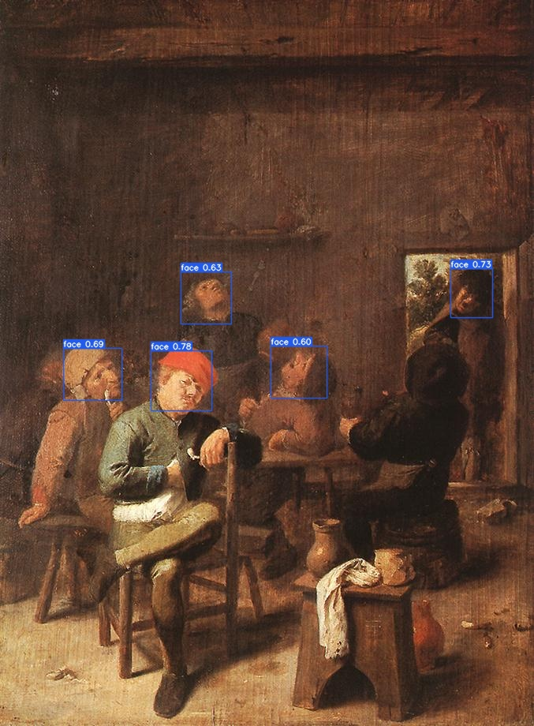
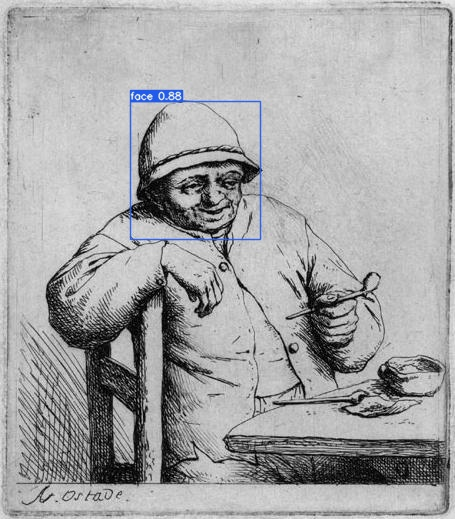
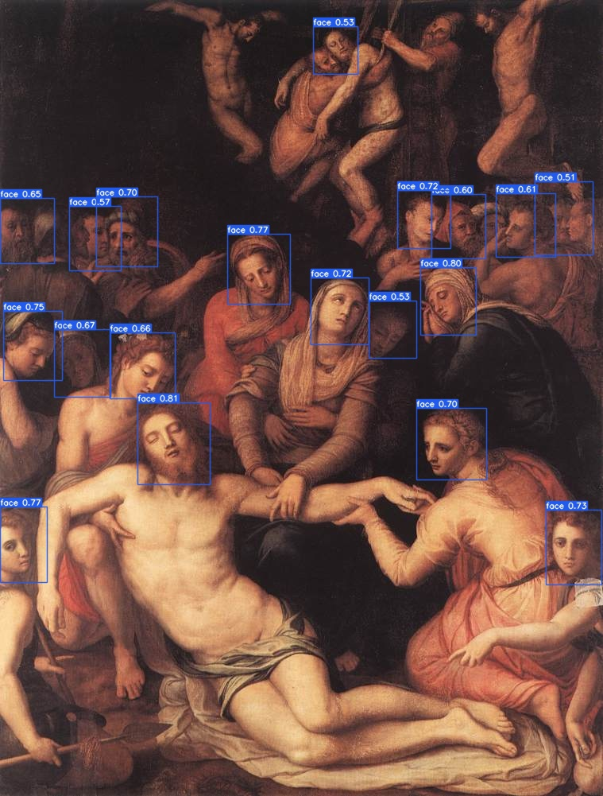
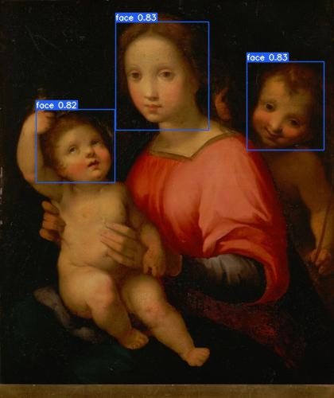

## Command 

To train the model, use the command below:

```
python train.py --data data/data.yml --img-size 512 
```

To test the model, use the command below:

```
python detect.py --data inference/images --img-size 512
```


## Detection demos







